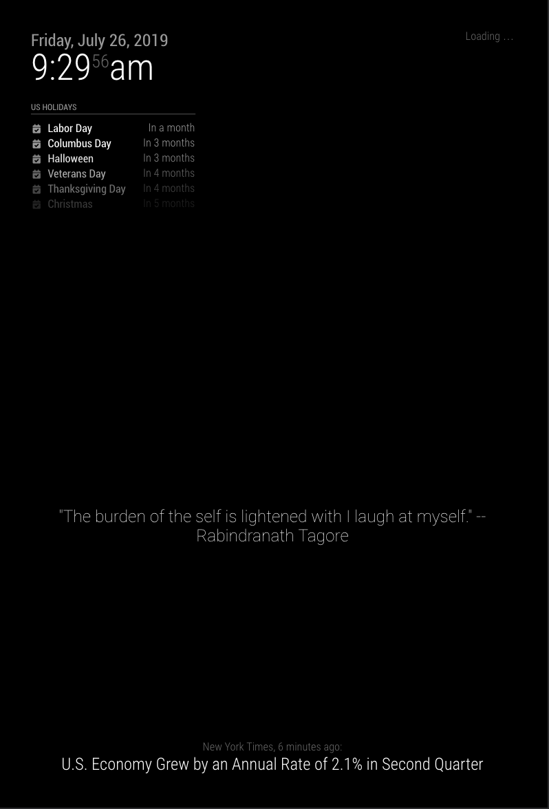

# MMM - QuotesFromReddit

A magic mirror module that is to replace the compliments module. It pulls a random title from reddit.com/r/quotes and displays it on your magic mirror!

## Installation

To install simply clone this repository into the `modules` folder within the `MagicMirror` folder.

```shell
git clone https://github.com/bthuilot/MMM-QuotesFromReddit.git ~/MagicMirror/modules/MMM-QuotesFromReddit
```

Then edit your config file in the `config` folder to feature the following.

**Important**
I Would recommend removing the `compliments` module and putting this in place

```javascript
{
  module: "MMM-QuotesFromReddit",
  position: "lower_third" // Can be any of the regions
}
```

_Side note:_ Keep in mind this is randomly picking a post from a subreddit so there will be some posts where the title is not  a quote

## Screen Shots

An example quote


Quote with the entire mirror


